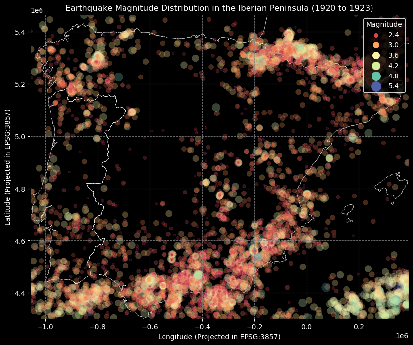

# Day 1 - Earthquakes in the Iberian Peninsula between 1990-2023

This project provides a point map looking at choropleth density per strength of earthquake data spanning from 1990 to 2023. 

## Output

## Usage
To use this script, update the `file_path` variable with the location of your CSV file containing earthquake data. Run the script to generate insights and visualizations based on the dataset.

---
